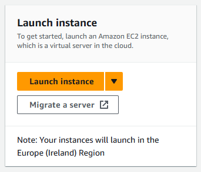
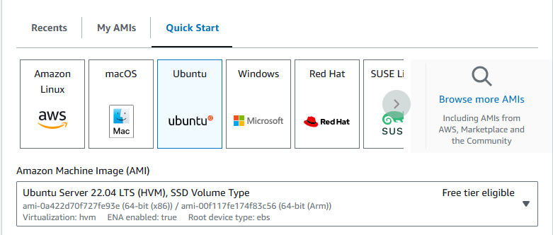
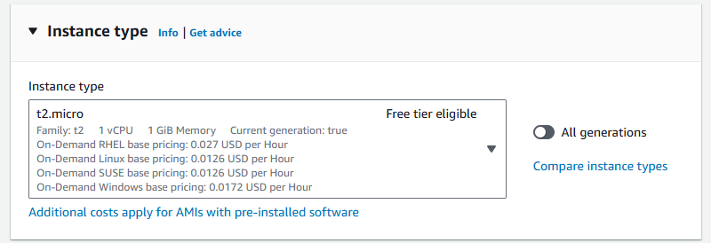

# Deploying an App in 2-Tier Architecture on AWS

- [Deploying an App in 2-Tier Architecture on AWS](#deploying-an-app-in-2-tier-architecture-on-aws)
  - [Steps to Deploy](#steps-to-deploy)
    - [1. Launch EC2 Instances](#1-launch-ec2-instances)
    - [2. Select App and OS Image](#2-select-app-and-os-image)
    - [3. Select Instance Type](#3-select-instance-type)
    - [4. Key Pair Login](#4-key-pair-login)
    - [5. Network Settings](#5-network-settings)
    - [6. Advanced Details](#6-advanced-details)
    - [7. Review and Launch](#7-review-and-launch)
  - [Conclusion](#conclusion)

This guide will walk you through the steps to deploy an application using a 2-tier architecture on AWS. The architecture consists of an application tier and a database tier.

.png>)

## Steps to Deploy

### 1. Launch EC2 Instances

1. **Search for EC2**:
   - In the AWS Management Console, type `EC2` in the search bar and select it.

2. **Launch Instances**:
   - Navigate to **Instances** and select **Launch Instances** on the right.

        

3. **Input an Appropriate Name**:
   - Provide a name for your instance.

### 2. Select App and OS Image

1. **Choose an AMI**:
   - Select **Ubuntu Server 22.04 LTS (HVM), SSD Volume Type**.

### 3. Select Instance Type

1. **Choose Instance Type**:
   - Make sure to select **t2.micro** for the instance type.

### 4. Key Pair Login

1. **Create a New Key Pair**:
   - Input the correct name.
   - Select **Create** and download your `.pem` key. This is the equivalent of a **private key** on **Azure**.

2. **If Previously Created**:
   - Use an existing key.  

### 5. Network Settings

1. **Create Security Group**:
   - Select **Create security group**. *Remember, you need a **UNIQUE** security group for each VM.*

2. **Allow Traffic**:
   - For the **Database** Security Group:
     - allow **SSH** traffic
     - allow **MongoDB** traffic on port **27017** with source the app's **Security Group**

   - For the **App** Security Group:
     - allow **SSH** traffic
     - allow **HTTP** traffic.

3. **Create Subnets**:
   - For the **Database**, create a **private** subnet.
   - For the **App**, create a **public** subnet.

4. **Edit IP Addresses**:
   - Use `172.31.2.0/24` for your **app**.
   - Use `172.31.3.0/24` for your **database**.

### 6. Advanced Details

1. **User Data**:
   - Locate user data and input the relevant data for the **EC2**.

### 7. Review and Launch

1. **Review Details**:
   - Review your details and then launch the instance.

## Conclusion

By following these steps, you can successfully deploy an application using a 2-tier architecture on AWS. This setup ensures that your application and database are properly isolated and secured, providing a robust environment for your application to run.
