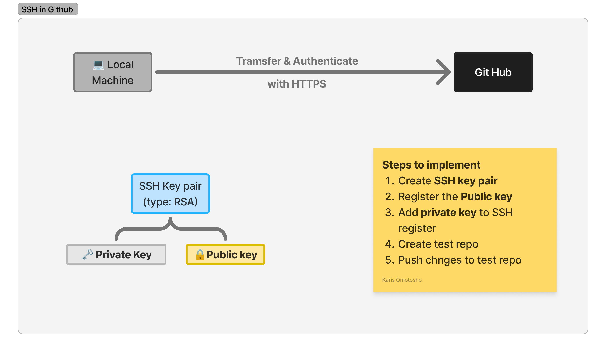

# How to set up SSH access on Github



## Create an SSH Key Pair

Follow the steps on how to [create ssh key pair](README.md#create-an-ssh-key-pair)

# Adding SSH key to Github

1. Generate a new SSH key.
2. Print the **public** key using `cat`. This will be given to GitHub.
3. Navigate to your **Settings** on GitHub.
4. Find **SSH Keys and GPG keys** and add **New SSH key**.
5. Name the key appropriately.
6. Insert what you printed and save.

## Register a key

1. Start your ssh agent with ```eval `ssh-agent -s` ```
2. `ssh-add` your `private key`. This will add your identity.
3. **Test** your connection to GitHub using `ssh -T git@github.com`.
4. You will either get a prompt to then type `yes`, or it will say you're successfuly authenticated. This works **ANYWHERE** in your directory.

## Changing a initialised repo

To change an initialized Git repository to use SSH instead of HTTPS, follow these steps:

1. **Check Current Remote URL**: First, verify the current remote URL to see if it's using HTTPS.

    ```bash
    git remote -v
    ```

2. **Change Remote URL to SSH**: Replace the HTTPS URL with the SSH URL. You can do this using the `git remote set-url` command.

    ```bash
    git remote set-url origin git@github.com:username/repo.git
    ```

    Replace `username` with your GitHub username and `repo.git` with the name of your repository.

3. **Verify the Change**: Confirm that the remote URL has been updated to use SSH.

    ```bash
    git remote -v
    ```

### Example

Let's say your current remote URL is:

```bash
origin  https://github.com/username/repo.git (fetch)
origin  https://github.com/username/repo.git (push)
```

To change it to SSH, you would run:

```bash
git remote set-url origin git@github.com:username/repo.git
```

After running the command, verify the change:

```bash
git remote -v
```

The output should now be:

```bash
origin  git@github.com:username/repo.git (fetch)
origin  git@github.com:username/repo.git (push)
```

### Additional Steps

1. **Generate SSH Key (if not already done)**:

    ```bash
    ssh-keygen -t rsa -b 4096 -C "your_email@example.com"
    ```

    Follow the prompts to save the key.

2. **Add SSH Key to SSH Agent**:

    ```bash
    eval "$(ssh-agent -s)"
    ssh-add ~/.ssh/private_key
    ```

3. **Add SSH Key to GitHub**:
    - Copy the SSH key to your clipboard:

        ```bash
        cat ~/.ssh/public_key.pub
        ```

    - Go to GitHub > Settings > SSH and GPG keys > New SSH key, and paste the key.
